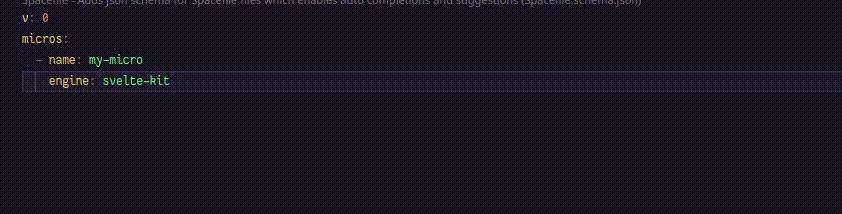

# Spacefile-schema

Adds json schema for `Spacefile` files which enables auto completions and suggestions



**[ICON](./icon.png)** credits to [Deta Space](https://deta.space/)

## Install

```
ext install tbdsux.spacefile-schema
```

[Marketplace](https://marketplace.visualstudio.com/items?itemName=tbdsux.spacefile-schema)

### What's Spacefile?

The Spacefile file contains the configuration of your app and is used by [Deta Space](https://deta.space/) to understand what your app looks like and how to run it.

https://deta.space/docs/en/reference/spacefile

##

Contributions are always welcome and open

##

**tbdsux | &copy; 2023**
